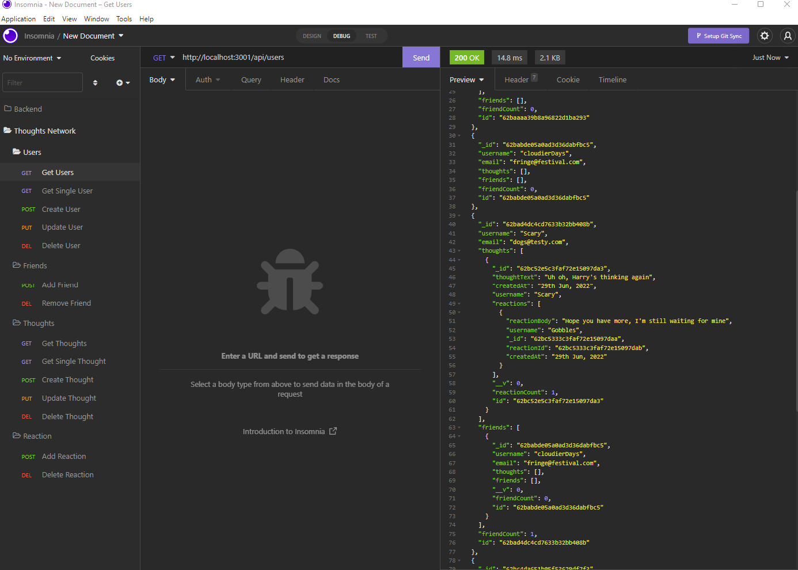
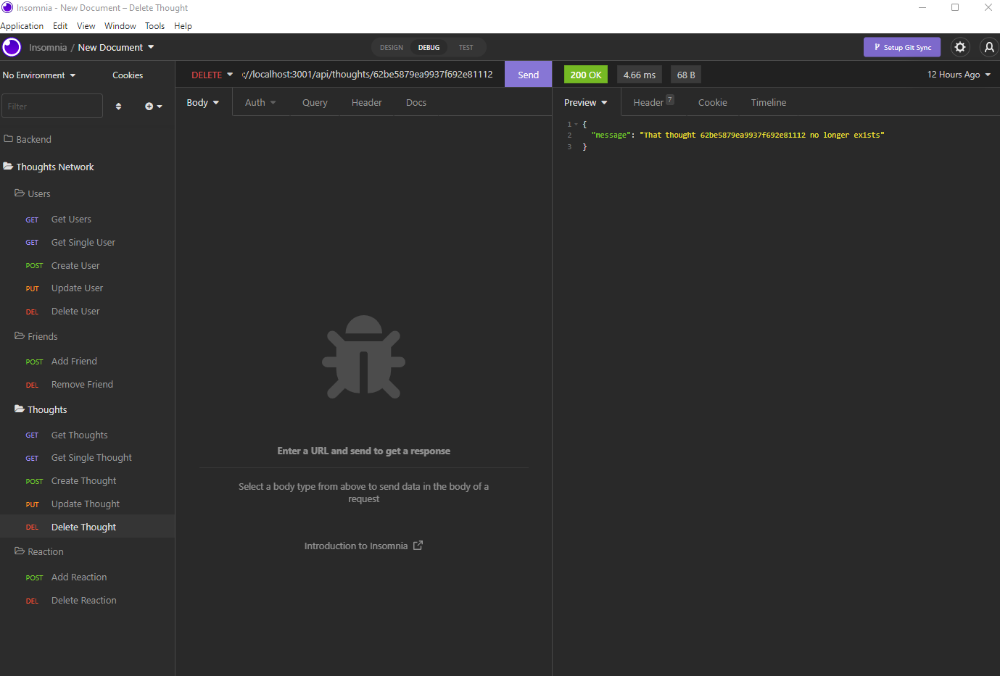
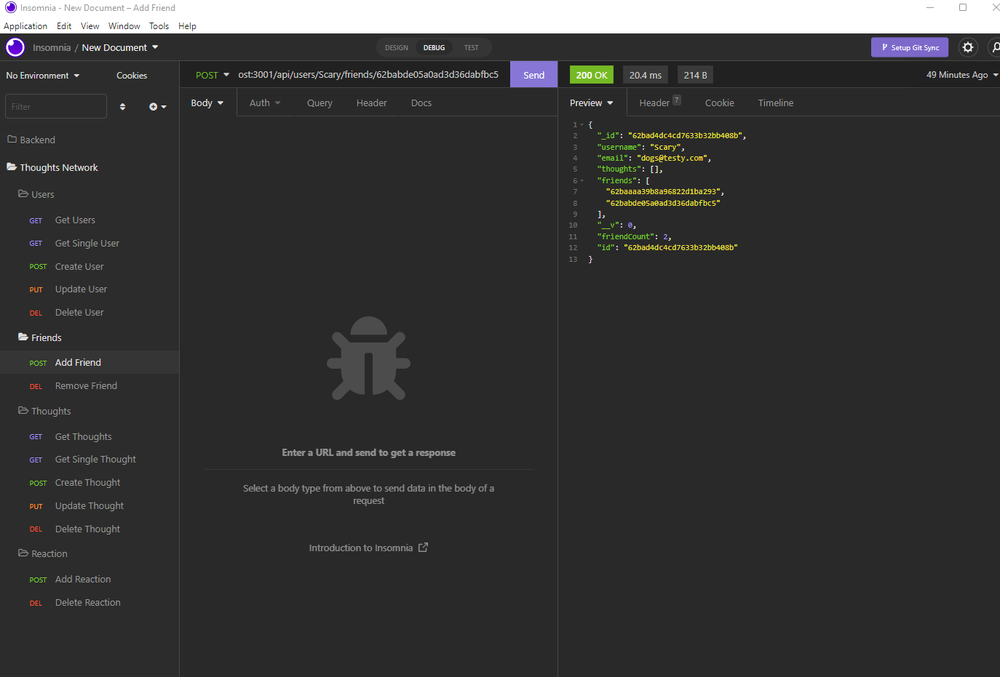
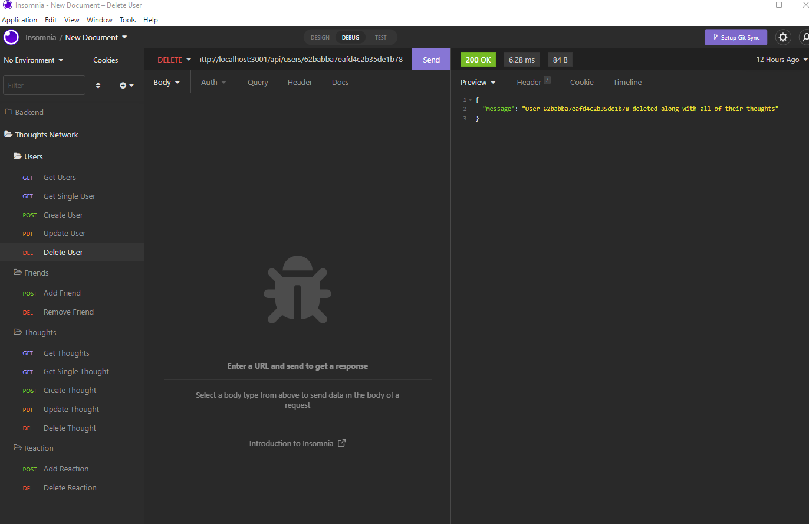

# Social Networking Backend  

  

## Description

The project uses a MongoDB database, with the ODM Mongoose, to create the backend for a social networking database that allows users to share their thoughts.

  
## Table of Contents

- [Installation](#installation-notes)
- [Usage](#usage)
- [Credits](#credits)
- [Contributing](#contributing)
- [Questions](#questions)
- [License](#license)

## Installation Notes  

  At this point, there is no front end for the project.  Copy from Github and maintain folder structure.  Open to the folder and use NPM to install the dependencies.  Once complete, type npm run start to open the application.  Nova or similar software can be used to test the routes.   

## Usage 

  Project can be started within Node.  Nova or similar software can be used to test the routes.  Users can be created, updated and deleted.  Thoughts can be created, updated and deleted.  A single user or all users can be displayed.  A single thought or all thoughts can be displayed.  Reactions can be added or removed from thoughts.  Friends (other users) can be added or removed from a Users profile.  Thoughts are linked to the User that created the thought and reactions retain the identity of the User entering the reaction.  The majority of the data is dated on creation.   

 

  A video walkthrough of the routes in action can be found at: 

 

  The Project code repository is stored at: https://github.com/Cancer2806/Thoughts 

 

  Following are screenshots showing the routes being used in Nova:  

Get Users:
 
  
This route lists all users with Friends and Thoughts fully populated

 

Delete Thought:
 
  
This route allow a Thought to be deleted  

 

Add Friend:
 
  
This route add a Friend sub-document to a User  

 

Delete User:
 
  
This route deletes a User along with all of their Thoughts  

 

## Credits  

  Node, MongoDB, Mongoose, Express, are heavily used in the Project.  Nova was used for testing the routes.   

## Contributing  

  Suggestions for contributions can be sent by email   

## Questions
Questions can be submitted by email

Github:  https://github.com/Cancer2806

Email:  frank.lavery@westnet.com.au

## License
This project is licensed under [MIT](https://opensource.org/licenses/MIT).
